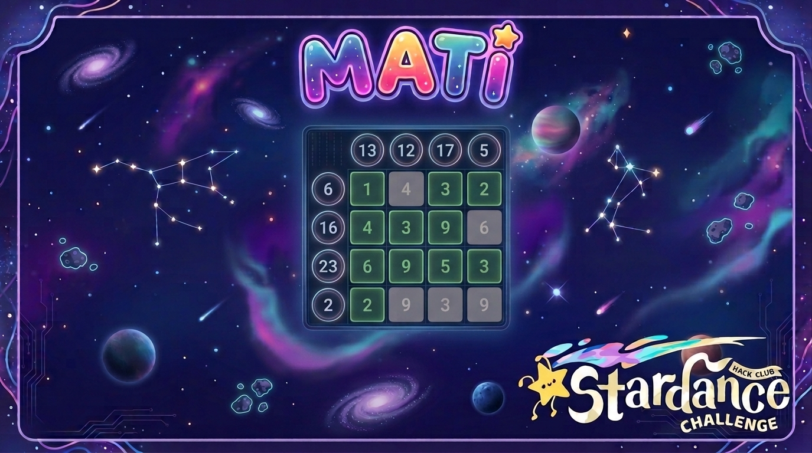

# Mati

**Mati** is a desktop number-puzzle game for Windows, macOS, and Linux, built with Python and **Pygame**.

Current version: **V0.7.1.2 (Beta V1.0.30)**.




---

## Try Mati

Public_Beta_1.0.0_(1.0.30) is the codebase.

To just run the application dopple click on MATI.exe

If you are on another operation system, you need to run it manually
or more likely do not give a feedback on this project, because it 
uses graphic methods for windows, so it looks different and not as
wanted on the other OS:

For other languages run the corresponding language file
and again the main file.


## Features

- **Grid puzzles** from **4×4 up to 7×7**, with Easy, Normal, Hard, and Custom difficulties.
- **Undo, hints, timers, and keyboard controls** during a match.
- **Match history and achievements**, with saved game files and detail views.
- **MP4 video export** of completed matches with selectable quality and frame rate.
- **Procedurally generated sound effects**, with no external audio assets required.
- **Localisation support** with an English fallback and supplementary German, Spanish, and French language scripts.
- **Scalable rendering and extra game features**, including Auto/1x/2x/4x scaling, a tutorial, hidden terminal, and easter eggs.

Wanna see more features? -> They are in the features.md.

---

## Quick Start

Mati currently does not ship with a `requirements.txt` or `pyproject.toml`, so the runtime dependencies are installed directly with pip.

### Prerequisites

- **Python 3.10+** — the code uses `match` statements and modern type annotations.
- **Pygame**, **NumPy**, and **PyAV (`av`)**.
- **tkinter** is also used by the standard library for native file dialogs during save/export operations.

### Run

From the folder containing `main.py`:

```bash
python -m pip install pygame numpy av
python main.py
```

Supplementary language packs are optional. The corresponding creator scripts, such as `create_language_de.py`, are not required to launch the game.

---

## How It Works

### Rendering model

Mati renders internally at a fixed virtual resolution of **800×600** and then scales that image to fit the real window. Scaling modes are:

- **Auto** — fits the largest 4:3 area into the window using smooth scaling.
- **1x / 2x / 4x** — integer upscaling with nearest-neighbour scaling for crisp pixel-like rendering.

Text rendering is cached and can be supersampled at higher quality settings, then downscaled to the logical text size for crisper glyphs.

### Gameplay loop

The main module (`main.py`) owns the top-level state machine. Different screens are drawn depending on `game.state`, including menus, settings, statistics, achievements, history, gameplay, tutorial, and the hidden terminal.

Input handling distinguishes mouse interaction from keyboard navigation, with optional keyboard-navigation mode and focus tracking. There is also a jump-back system and scroll handling for history and detail views.

### Level generation and win checking

Levels are generated in `level.py` and include logic for generating puzzles, checking wins, and finding hints. The visual grid, row/column sums, selection state, and dimming are managed in the game module and drawn by the screens/widgets layer.

### Sound

Sound effects are generated procedurally in `audio.py` by synthesising stereo sine-wave tones with short fades instead of loading audio files from disk. The mixer is initialised at the configured sample rate. Sounds can be enabled or disabled globally, and terminal sounds can be toggled separately.

### Persistence

Saved games and settings use a small custom format in `persistence.py`:

1. Data is serialised as JSON.
2. The JSON is compressed with zlib.
3. The compressed bytes are XOR-obfuscated with a fixed key (`Mati_Obfuscation_Key_2026`).
4. The result is base64-encoded into a text blob and stored in `.mati` / `.smati` files.

This is not intended as strong security; it is a lightweight way to make saved data less directly editable.

### Video export

When a match is exported, `export.py` renders the recorded match frames and mixes them with procedurally generated audio, then encodes an MP4 via **PyAV**. Export options include quality scaling and frame rate selection. Export can run in a modal-like overlay while the rest of the application keeps running.

### Adaptive redraw and performance hooks

The main loop contains adaptive redraw timing helpers for live clocks, timers, and terminal-style clocks, along with cache keys for redraw gating based on window size, mouse position, export progress, and clock/timer text changes. Scrollbars have visibility timing, and there are key-repeat delays for hold-to-repeat behaviour.

---

## Installation and Local Development

### Repository structure

The release folder `V0.7.1.2` contains the main game code:

- `main.py` — entry point and main event loop
- `game.py` — game state, match logic, and event handling
- `level.py` — level generation and win checking
- `screens.py` — screen drawing logic
- `widgets.py` — widget drawing helpers
- `buttons.py` — button definitions
- `alt_hover.py` / `alt_hover1.py` — alternate hover / focus behaviour
- `audio.py` — procedural sound generation
- `export.py` — MP4 video export
- `persistence.py` — save/load for `.mati` / `.smati` files
- `replay.py` — game replay reconstruction
- `terminal.py` — hidden terminal feature
- `tutorial.py` — tutorial screen
- `helpers.py` — shared helpers
- `lang.py` — translation loading and lookup
- `config.py` — central constants and defaults

Language packs live under `rsc/languages`. Supplementary language builder scripts are included next to the runtime code, for example `create_language_de.py`, `create_language_es.py`, and `create_language_fr.py`.

### Configuration and runtime behaviour

Configuration lives in `config.py` and is loaded at runtime. There is no `.env` file required. The game stores user settings, stats, and match history in its own data files (`.mati`, `.smati`, plus an export history file) in the working directory or under a local `history/` folder.

Important defaults from the code:

- Internal render size is **800×600** (4:3), then scaled to the window.
- Audio sample rate is **44100 Hz**.
- Exported video default is **30 FPS**, with selectable 30/60 FPS options.
- Default language is **English** (`english`), with a built-in fallback if a chosen language pack is missing.

On some systems, sound may be disabled or behave differently if the mixer cannot initialise; the game handles sound initialisation failures by marking sound as unavailable rather than crashing.

---

## Credits

- **Pygame** — windowing, input, rendering, and mixer support.
- **NumPy** — numerical helpers used in audio and export paths.
- **PyAV (`av`)** — MP4 export encoding.
- **Python standard library**, including `tkinter` used for native file dialogs during save/export flows.
- **Author:** Janosch Klawatsch (Jay/JKfromHMS).

Language-related scripts can generate supplementary translation packs for German, Spanish, and French. The built-in fallback language is English. Translations are created with help of online dictionaries, so wrong translations are possible.

---

## License

Mati is distributed under the **PolyForm Noncommercial License 1.0.0**.

Required notice: **Copyright JKfromHMS (https://github.com/JKfromHMS/Mati)**.

See `LICENSE` in the repository root for the full terms.
